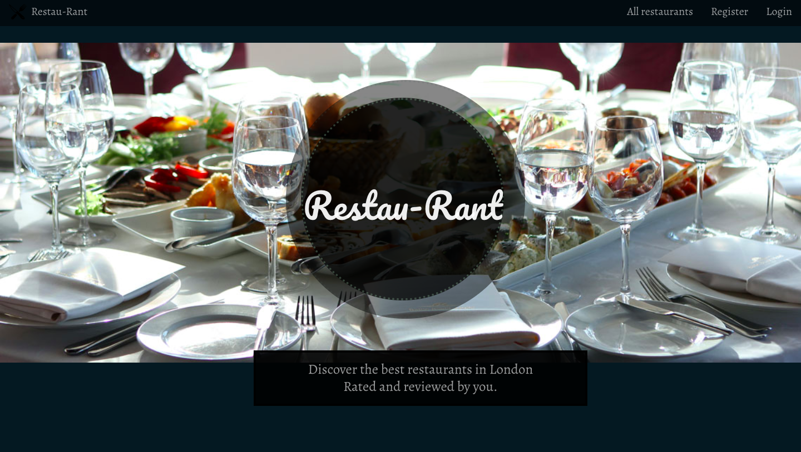
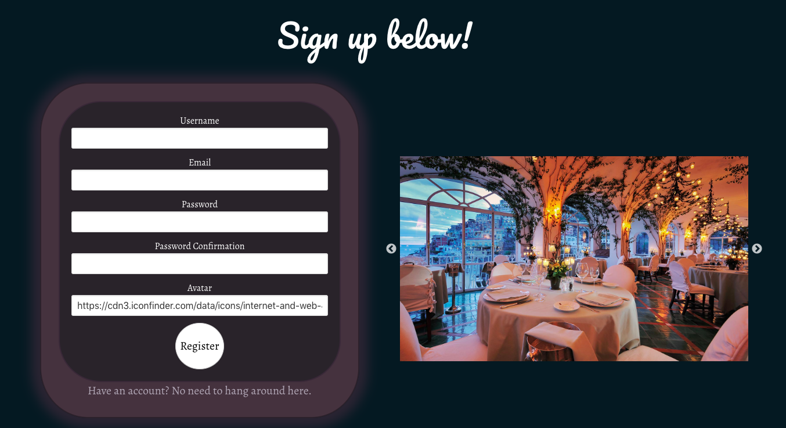
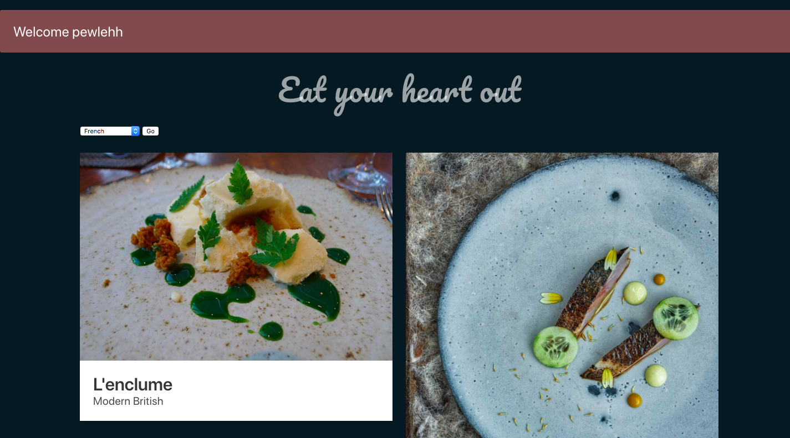
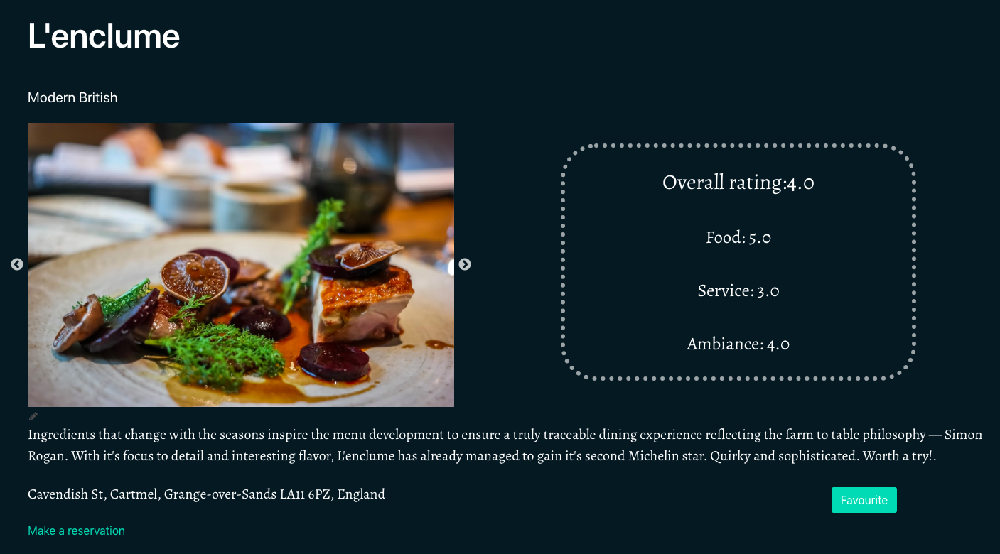
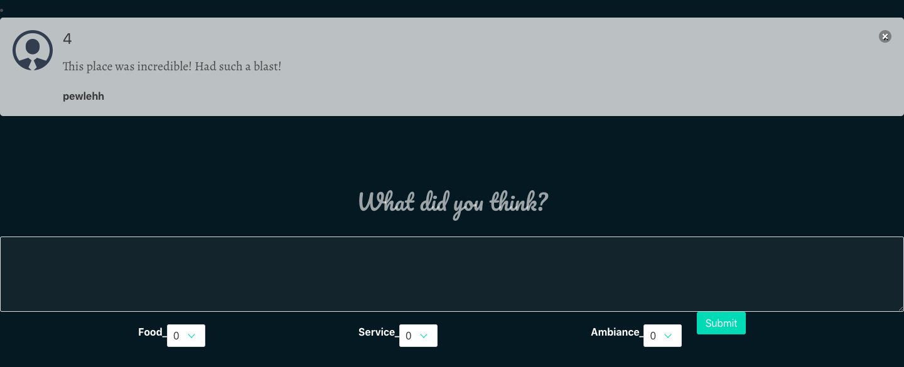
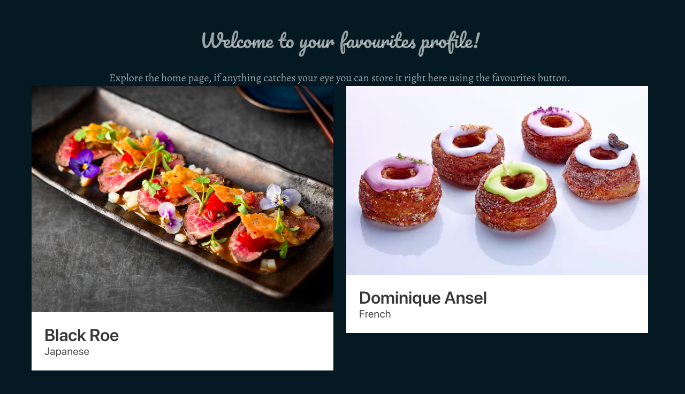

GA WDI LDN Project 2

# GA WDI-32   Project 2 - Restau-Rant

- **M**ongo - For the database
- **E**xpress - For the web-framework
- **N**ode - For the server-side language
- **A**ngular - Angular(1) for the client-side framework**.
- **EJS**.

The hint’s in the name! A site that allows you to rant about your favourite restaurants.
Peruse the index of locations or filter through your ideal cuisine to discover exciting new places for you to experience.

##### [Visit the website](https://restau-rant-new.herokuapp.com/) for best *viewing* experience (the application is not yet designed for mobile).
---

Users are able to create accounts in order to access features in the site such as being able to favourite, comment and add restaurants of the users choice.
They are also able to edit and delete the restaurants they've added themselves.
   

Once signed in, users are greeted with a flash message welcoming them back. The gallery depicts all restaurants available and a filter is located at the top left hand side of the screen based on the cuisine the user desires.

Each restaurant has is own show page where the overall rating is depicted by the carousel displaying images of the food and/or location.
A direct link allows easy access to the restaurants booking service.

If authenticated, the user is able to leave their rating alongside a comment. The comment will depict the users profile picture, or a standard icon if one was not chosen.

A final feature is the profile pages. If a user likes a particular restaurant they can click the favourite button and have a direct link stored on their personal pages.

_________________
###### MORE TIME

Had I had more time, I would have focused more on the design aspect of the website. There are some features, such as the signup/login page that I went a little overboard with fades and such. The home page contains Bulma cards that are different sizes. Details such as those could be revisited.

It would be nice to add more filtering options, perhaps by average or specific ratings.

## Setup instructions

Clone or download the repo  
Install dependencies with `yarn install`
Launch the app with `yarn start`
